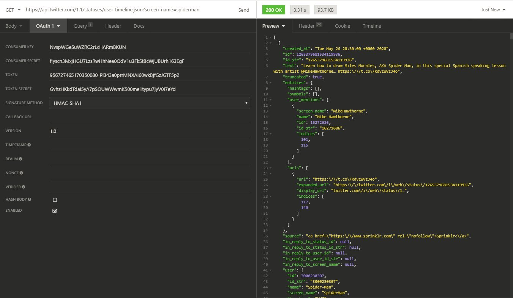
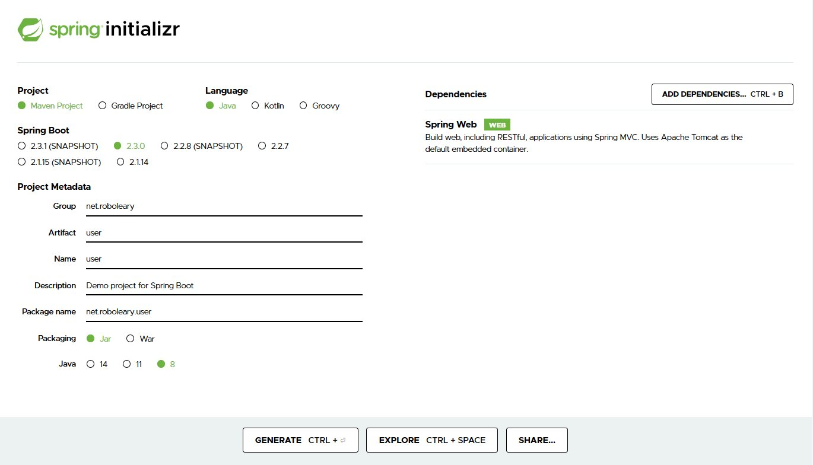
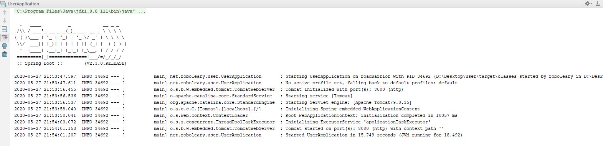

- [What is an API?](#what-is-an-api)
- [Twitter API Example](#twitter-api-example)
- [What we will build](#what-we-will-build)
- [Is this the latest way?](#is-this-the-latest-way)
- [Is there anything I should know before I start?](#is-there-anything-i-should-know-before-i-start)
  - [A little bit about Design Patterns](#a-little-bit-about-design-patterns)
    - [Model View Controller](#model-view-controller)
    - [Other patterns that may be used](#other-patterns-that-may-be-used)
  - [HTTP Basics](#http-basics)
  - [A little bit about REST](#a-little-bit-about-rest)
- [What you need to complete this tutorial](#what-you-need-to-complete-this-tutorial)
- [How to set your project up](#how-to-set-your-project-up)
- [Get All Users](#get-all-users)
- [Get User by ID](#get-user-by-id)
- [Get User by Name](#get-user-by-name)
- [Add a new User](#add-a-new-user)
- [Update a User](#update-a-user)
- [Partial Update of a User](#partial-update-of-a-user)
- [Delete a User](#delete-a-user)
- [How to verify your application](#how-to-verify-your-application)
- [Source code](#source-code)
- [Next Steps](#next-steps)

Tutorials I have seen are either too trivial ([Hello World API](http://spring.io/guides/gs/rest-service/)) to help you understand how to build an API; or overwhelm beginners and assume too much about what you know. So, here I will build a simple API, which is closer to what you would realistically build, but will empower you to build a complete API. I will go through everything from start to finish, you can skip ahead if you know something already.

## What is an API?

It is common now for companies to give access to their data through APIs. API stands for Application Programming Interface, it is a list of methods we can use to interact with a company's data. These methods are often referred to as web services because we call the methods using HTTP requests.

Let's look at an example of an API to clarify what it is exactly!

### Twitter API Example

Let’s look at the Twitter API. I'm guessing you know what Twitter is already, but let's state what it is regardless, Twitter is a social micro-blogging website. It's where Donal Trump vents publicly!

[Twitter's API reference](https://developer.twitter.com/en/docs/api-reference-index) gives you a long categorized list of methods. You can do a wide range of actions with tweets, direct messages, your personal account settings, almost everything you can do through the website is possible to do through the API. If you wanted to, you could use the API, and build an entirely different front-end for Twitter, or build a TwitterBot.


Let's take an example of using the API, say we want to get all of the tweets from the timeline of **@spiderman**. Looking through the list of methods, [GET statuses/user_timeline](https://developer.twitter.com/en/docs/tweets/timelines/api-reference/get-statuses-user_timeline) seems to be the method that matches what we want. This is the method description:


We need to have a client application to use the API to execute our HTTP request to call the method. I like to use [Insomnia](https://insomnia.rest/), but other popular applications are: [cURL](https://curl.haxx.se/) (a command-line tool), [Postman](https://www.postman.com/) (a collaboration platform for API Development), and [Postwoman](https://postwoman.io/) (an open-source alternative to Postman).

Looking at the method description, we need to provide 1 parameter in our request to get the data we want, this parameter is `screen_name`.

To use Twitter's API, you have to have a Twitter account, and register as a developer to obtain some keys. When you interact with the API, you provide these keys to authenticate your identity. This ensures that only you can only change your own account data, and generally that you use the platform in a fair way .

You need to do some configuration in your Twitter account settings to get the developer keys. It's a bit tedious to get this done! I wont show you how, the focus is on showing what the API is and how it can be used. This is what our request looks like on the left, and the response received is on the right.



You can see that our `screen_name` parameter is appended to the URL (highlighted in yellow). We use a question mark to mark the beginning of our parameters, then we provide the parameter name and value. You can provide a list of parameters if you need to, you separate each parameter by an ampersand.

As you can see the latest Tweet from Spiderman is telling everyone that you should "Learn how to draw Miles Morales, AKA Spider-Man, in this special Spanish-speaking lesson with artist @MikeHawthorne… https:\/\/t.co\/RdvzWVzJ4o.". 🕸️🎨

## What we will build

We’ll build a web service for a _User_. We want someone to use our app, don't we? 😅🙏

We will not use a database like a real application would. We will have some dummy data to mimic this.

The table below summarises our User API.

When we run our App. The default local address for your Spring Boot application should be: `http://localhost:8080`, so the address to get all users would be `http://localhost:8080/users` for example. Spring follows conventions that does things in a default way, we can override this if we want to go our own way.

<table>
  <tr>
    <th>HTTP Method</th>
    <th>Address</th>
    <th>Action</th>
  </tr>
  <tr>
    <td>GET</td>
    <td>/users</td>
    <td><a href="#get-all-users">Get all users</a></td>
  </tr>
  <tr>
    <td>GET</td>
    <td>/users/{id}</td>
    <td><a href="#get-user-by-id">Get users by id</a></td>
  </tr>
  <tr>
    <td>GET</td>
    <td>/users?name=rob+oleary</td>
    <td><a href="#get-user-by-name">Get user by name</a></td>
  </tr>
  <tr>
    <td>POST</td>
    <td>/users</td>
    <td><a href="#add-a-new-user">Add a new user</a></td>
  </tr>
  <tr>
    <td>PUT</td>
    <td>/users</td>
    <td><a href="#update-a-user">Update a user</a></td>
  </tr>
  <tr>
    <td>DELETE</td>
    <td>/users/{id}</td>
    <td><a href="#delete-a-user">Delete a user</a></td>
  </tr>
</table>

## Is this the latest way?

Spring Boot is evolving version by version, so its worth noting that you may see some differences between examples, and this can be a bit confusing. Most choices are stylistic, and some are based on changes to the framework. The current stable version is 2.3.0.

I would always suggest looking at the most recent tutorial that you can find, and choose a tutorial style that matches your learning preferences.

## Is there anything I should know before I start?

A common issue when beginning to learn how to build APIs with Spring Boot is that tutorials expect you to know something about the [design patterns](https://en.wikipedia.org/wiki/Software_design_pattern) that are being implicitly used by Spring; or they treat it as a mechanical process to follow: put this here, write a method like this, add this annotation, and on and on. This isn't a great way to learn. I will help you to understand why you're doing things in a particular way.

### A little bit about Design Patterns

- A design pattern is a general, reusable solution to a commonly occurring problem.
- Design patterns can speed up the development process by providing tested, proven solutions.
- Reusing design patterns helps to prevent small mistakes that can cause major problems later on.

Bigger applications are divided into layers with particular responsibilities, this makes it easier to maintain
them. Spring uses the [Model-View-Controller (MVC) ](https://blog.codinghorror.com/understanding-model-view-controller/) design pattern for building web applications.

#### Model View Controller

MVC is a way of organizing your code. The big idea behind MVC is that each _layer_ of your code has a purpose. It makes it easier to build and maintain your application.

What is the purpose of each layer:

- **Model**: The model captures the real-world things your application is concerned with. It _models_ the real world. The classes in the model are used to store and manipulate state of your application.
- **View**: The view is the user interface. It renders the model to the user. In a web application, this is the web page written in HTML, the "front-end" of your application. <u>**We don't write this in our example application.**</u>
- **Controller**: The Controller code is the liaison between the Model and the View, it receives the user input and decides what to do with it. The controller in a web application has two parts. The first part is the web server that matches incoming HTTP Requests to a particular handler method, this is part of Spring Boot. The second part is the handler methods themselves, which can be confusingly called "controllers" also, this is the bit that we write. The handler methods are responsible for returning data from the model.


The advantage of this approach is that our application is more [loosely-coupled](https://en.wikipedia.org/wiki/Loose_coupling). You can change the view and the model can remain the same, and vice-versa. This separation makes application more maintainable.

If you would like a more in-depth explanation, you can read this [MVC article](https://blog.codinghorror.com/understanding-model-view-controller/).

#### Other patterns that may be used

In our example, we only use the MVC pattern implicitly.

In more **advanced examples**, you may also encounter or need to use the following design patterns:

- [Data Access Object layer](https://www.tutorialspoint.com/design_pattern/data_access_object_pattern.htm) / [Repository layer](http://blog.sapiensworks.com/post/2014/06/02/The-Repository-Pattern-For-Dummies.aspx) : When you use a database, you will probably use one of these patterns. This layer controls access to the stored data, it isolates other parts of the application from knowing about the source of the data, they don't know if it is a database or spreadsheet or text file! You will create data repositories when you have a database in Spring Boot.
- [Service layer](https://martinfowler.com/eaaCatalog/serviceLayer.html): This layer is where our common business logic lives, you use repositories to perform tasks. For example, a Book Service might use the User repository and Book repository to offer functionality such as "search for my books", validating if the user is logged in before it will return a list of the User's books.

### HTTP Basics

HTTP is the foundation of data communication for the World Wide Web. It follows a request-response protocol.

[HTTP resources](https://en.wikipedia.org/wiki/Web_resource) are identified and located on the network by [Uniform Resource Locators](https://en.wikipedia.org/wiki/Uniform_Resource_Locator) (URLs), using the [Uniform Resource Identifiers](https://en.wikipedia.org/wiki/Uniform_Resource_Identifier) (URI's) schemes _http_ and _[https](https://en.wikipedia.org/wiki/Https)_. In the case of a web application, the resources are objects based on the classes in our model.

A **HTTP request** consists of the following:

- a request line. For example, `GET /users/1 HTTP/1.1`, which requests a resource called /users/1 from the server,
- request header fields,
- an empty line,
- and an optional message body.

HTTP defines a set of **request methods** that define the action to be performed on a given resource. They are sometimes referred to a HTTP verbs. The following HTTP request methods are used in web applications:

- **GET**: Retrieve data of a resource.
- **POST**: Create a new resource.
- **PUT**: Update or replace a resource.
- **PATCH**: Update or modify a resource.
- **DELETE**: Delete a resource.

You will often see the core functions of a web application referred to as CRUD, which stands for: Create, Read, Update, Delete.

The **HTTP Response** consists of the following:

- a status line which includes the status code and reason message,
- response header fields,
- an empty line,
- an optional message body.

Below is a **summary of the typical content in a Response for the methods**.

<table class="table table-striped table-bordered">
						<thead>
							<tr>
								<th>HTTP Method</th>
                                <th>CRUD</th>
								<th>Response for an entire collection (e.g. /users)</th>
								<th>Response for a specific item (e.g. /users/{id})</th>
							</tr>
						</thead>
						<tbody>
							<tr>
								<td>POST</td>
								<td>Create</td>
								<td>Status Code: 201 (Created) if successful, 404 (Not Found) or 409 (Conflict) if the resource already exists. <br><br>'Location' header with link to /users/{id} where {id} is the new ID.</td>
								<td>Status Code: 201 (Created) if successful, 404 (Not Found) or 409 (Conflict) if the resource already exists.</td>
							</tr>
							<tr>
								<td>GET</td>
								<td>Read</td>
								<td>Status Code: 200 (OK). <br><br>A list of users contained in the body. <br><br>Pagination, sorting and filtering is used to enable navigation of big lists.</td>
								<td>Status Codes: 200 (OK) if successful, 404 (Not Found) if the ID is not found or invalid.<br><br>Return the customer data in the body if it is successful.</td>
							</tr>
							<tr>
								<td>PUT</td>
								<td>Update/Replace</td>
								<td>Status Code: 405 (Method Not Allowed), unless you want to update/replace every resource in the entire collection.</td>
								<td>Status Codes: 200 (OK) or 204 (No Content) if successful. 404 (Not Found), if the ID is not found or invalid.</td>
							</tr>
							<tr>
								<td>PATCH</td>
								<td>Update/Modify</td>
								<td>Status Code: 405 (Method Not Allowed), unless you want to modify the collection itself.</td>
								<td>Status Codes: 200 (OK) or 204 (No Content) if successful. 404 (Not Found), if the ID not found or invalid.</td>
							</tr>
							<tr>
								<td>DELETE</td>
								<td>Delete</td>
								<td>Status Code: 405 (Method Not Allowed), unless you want to delete the whole collection, which is rarely desirable.</td>
								<td>Status Codes: 200 (OK) if successful,  404 (Not Found), if the ID is not found or invalid.</td>
							</tr>
						</tbody>
					</table>

### A little bit about REST

You may have noticed I barely speak about REST in this article, and that's because I think it is a term used inappropriately too often when speaking about APIs and web services. It has become a nuisance. **The most important thing to know is if you build an API with a framework like Spring Boot, you are following most of the best practices of restful API design**.

Representational state transfer (REST) is an architectural style that defines a set of constraints to be used for creating web services. It was proposed by Roy Fielding in his doctoral dissertation in 2000. It is intended to be a guide for creating well-designed web applications by leveraging many of the conventions of the web. I recommend reading [this Stack Overflow thread on "What is Restful Programming"](https://stackoverflow.com/questions/671118/what-exactly-is-restful-programming) if you want to understand more.

Most web services today are restful, but they vary in how closely they follow the constraints from Fielding's dissertation. It gets murky quickly when people talk about how restful a web application is by comparing it to the academic definition.

Even an approach to provide a simpler set of heuristics by Leonard Richardson known as the **Richardson Maturity Model** (RMM), which breaks down the principal elements of a REST approach into three steps, has [received plenty of criticism](https://dev.to/mikeralphson/why-there-is-no-such-thing-as-the-richardson-maturity-model-3b4). If you want to understand more behind that, you can read about the [4 Maturity Levels of REST API Design](https://blog.restcase.com/4-maturity-levels-of-rest-api-design/).

## What you need to complete this tutorial

- About 1 hour.
- Your favourite text editor or IDE.
- JDK 1.8 or later.
- Gradle or Maven. You can skip this depending on your IDE, for example IntelliJ has maven built-in. I use maven.

## How to set your project up

You can use [Spring Initializr](https://start.spring.io/) to create your project. It offers a fast way to create a skeleton project. **<u>Only one dependency is required for this project and that's _Spring Web_</u>**. Really, all we need is have our project reference this dependency to get started, but the perk of using Spring Initializr is the folders and a default application class is constructed for you.

To use [Spring Initializr](https://start.spring.io/), fill in fields, and click generate. You can then download your project in a zip file.



Unzip the file and open it in your IDE of choice.

The dependencies may be downloaded automatically by your IDE when you import/open the project, or you may need to trigger the download yourself:

- In IntelliJ, you can go to `File > Synchronise` in the menu to trigger this.
- On the command-line:
  - For maven, run the command `mvn install`.
  - For gradle, run the command `gradle build`.

Spring Initializr created a default class to run you web application called **_UserApplication.java_**. You can run this to verify you are set-up correctly. It doesn't do anything yet aside from run a web server. You should see something like this on the command-line if it worked.



You can follow along and write the code with me, or you can download [the complete code from github](https://github.com/robole/spring-boot-api-for-beginners).

## Get All Users

Let's begin by writing the code, which will get all of our users.

### Create the model class

Our application is all about the user, which every application should be! 😉

We want to create a `User` class that has the attributes: _id_, _name_, and _age_.

Behind the scenes Spring creates empty objects when creating or updating users (responding to POST and PUT requests). So, you need to include a no-args constructor if you want to support these actions.

We add the typical methods to make a regular java class. Setter and getters are required for retrieving and modifying the attributes. We must include `equals` and `hashCode` methods to support the comparison of _User_ objects, when Spring checks to see if an user exists or not, it must know how to compare users. I used IntelliJ to generate all of these methods for me.

```java
public class User {
    private long id;
    private String name;
    private int age;

    //you must include a no-args constructor when you have a POST or PUT method
    public User(){ }

    public User(long id, String name, int age) {
        this.id = id;
        this.name = name;
        this.age = age;
    }

    //getters and setters, equals() and hashCode() generated by IDE
}
```

## Create a Controller

Remember, the controller is responsible for matching the HTTP request with a java method that returns a response.

We annotate our Controller with `@RestController`, and we add methods to handle the different requests. Spring is going to transform the data into JSON for us before it is returned as a response.

I have created an `ArrayList` of users to have some data to return.

The `getUsers` method returns all of the users for the URL [http://localhost:8080/users](http://localhost:8080/users). We specify this with an annotation of `@RequestMapping` or `@GetMapping`. We return the `ArrayList` and Spring does the rest!

```java
import com.roboleary.model.User;
import org.springframework.web.bind.annotation.RequestMapping;
import org.springframework.web.bind.annotation.RequestParam;
import org.springframework.web.bind.annotation.RestController;
import java.util.*;

@RestController
public class UserController {
    List<User> users = new ArrayList<User>();

    public UserController(){
        users.add(new User(1, "Rob OLeary", 21));
        users.add(new User(2, "Angela Merkel", 20));
        users.add(new User(3, "Tamer Osman", 20));
    }

    //for GET to http://localhost:8080/users
    @RequestMapping(method=GET, value="/users")
    public List<User> getUsers(){
        return users;
    }
  }
```

#### @RequestMapping Variants

Spring 4.3 introduced shortcut annotations, which serve the same purpose as `@RequestMapping` but have the HTTP method as part it's name.

You may seen them used also. They are:

- `@GetMapping`
- `@PostMapping`
- `@PutMapping`
- `@DeleteMapping`
- `@PatchMapping`

So, to annotate your method you could use this:

```java
@GetMapping(value="/users")
```

or this:

```java
@RequestMapping(method=GET, value="/users")
```

### Create a class to start the application

If you used Spring Initialzr, then this class is already created for you!

This is the main class which initiates the packaging of your web application, and then starts an embedded web server to run our web service for us.

```java
package com.spiderman.user;

import org.springframework.boot.SpringApplication;
import org.springframework.boot.autoconfigure.SpringBootApplication;

@SpringBootApplication
public class UserApplication {

	public static void main(String[] args) {
		SpringApplication.run(UserApplication.class, args);
	}

}
```

That's the hard bit done!

#### Run the application

Does it work? Run the `UserApplication` class, you can test the `GET` method in your Web Browser.


## Get user by ID

To get the user by ID, we want to be able to specify the ID in the URL.

For example, we navigate to [http://localhost:8080/users/2](http://localhost:8080/users/2) to get the user with an id of 2, and we expect to get this response:

```javascript
[{ id: 2, name: "Angela Merkel", age: 20 }];
```

We put the variable name within curly brackets as part of our `@GetMapping` annotation, and we declare it using the `@PathVariable` annotation in our method signature. We search through our `ArrayList` to find the first user with that id.

```java
@GetMapping(value="/users/{id}")
public User getUsersById(@PathVariable("id") long id){
     User found = null;

     for(User user: users){
         if(user.getId() == id){
              found = user;
              break;
         }
     }

     return found;
}
```

## Get user by name

To get the user by name, we want to be able to specify a parameter at the end of the URL.

For example, we navigate to [http://localhost:8080/users?name=rob oleary](http://localhost:8080/users?name=rob oleary)
to get the user with a name of "rob oleary".

A browser may add "+" for the space in the address like this: http://localhost:8080/user?name=rob+oleary,
spaces in URLs are considered [unsafe](https://stackoverflow.com/questions/497908/is-a-url-allowed-to-contain-a-space). You don't need to do anything differently, it will work either way! We expect to get this response:

```javascript
[{ id: 1, name: "Rob OLeary", age: 21 }];
```

We need to add `params` to our `@GetMapping` annotation to specify the parameter name. We need this to define an unique path, so Spring can map the request to the correct method with certainty.

We specify `@RequestParam` in our method signature, so we can use this variable inside our method to search for the user with that name. We use `equalsIgnoreCase()` to accept whatever mix of big and small letters we get from the client.

```java
@GetMapping(value="/users", params = "name")
public List<User> getUsersByName(@RequestParam(value="name") String name){
    List<User> filteredUsers = new ArrayList<User>();

    for(User user: users){
        if(user.getName().equalsIgnoreCase(name)) {
            filteredUsers.add(user);
        }
    }

    return filteredUsers;
}
```

## Add a new user

We add the user to our `ArrayList`. We use `ResponseEntity` as our method return type, it is a wrapper class where we can optionally include things such as: the status code (outcome of action), and headers to give the client information about the outcome.

This time our parameter is annotated with `@RequestBody`, this is because the data is provided in the body of the HTTP Request.

We return a status code of _HttpStatus.CREATED_, which is HTTP code of 201. There is no opportunity for there to be a failure to add a new user to our `ArrayList`, but you should consider this if you use a database.

```java
@PostMapping(value="users")
public ResponseEntity add(@RequestBody User u) {
       users.add(u);
       return new ResponseEntity(u, HttpStatus.CREATED);
}
```

## Update a user

Updates a user, or add a new user if there is no user found.

A PUT method is idempotent, which means if you run the operation multiple times, the result is the same.

Our parameter is annotated with `@RequestBody` again.

We return different status codes depending on whether we updated or added a user.

```java
@PutMapping(value="users")
public ResponseEntity addOrUpdate(@RequestBody User u) {
    ResponseEntity response;

    if(users.contains(u)){
        //update by setting it at the specified position
        int index = users.indexOf(u);
        users.set(index, u);
        response = new ResponseEntity(u, HttpStatus.OK);
    }
    else{
        users.add(u);
        response = new ResponseEntity(u, HttpStatus.CREATED);
    }

    return response;
}
```

We don't use PATCH in our web application. PATCH is used for partial update.

This may be used when you use a database as it is more efficient to only update specifically what has changed, rather than replacing an entire object. As we are doing everything in memory with an `ArrayList`, there is no benefit to this.

## Delete a user

We remove the user from our `ArrayList`, and return a status code to indicate if the user was found or not.

```java
@DeleteMapping(value="users/{id}")
public ResponseEntity delete(@PathVariable("id")long id) {
    boolean found = false;

    for(User user: users){
        if(user.getId() == id){
            users.remove(user);
            found = true;
            break;
        }
    }

    if (found == false) {
        return new ResponseEntity(HttpStatus.NOT_FOUND);
    }

    //found
    return new ResponseEntity(HttpStatus.OK);
}
```

## How to verify your application

If you want to create tests for your code, this is a separate topic to cover.

As mentioned previously, GET methods can be executed in your browser.

I will show you one example using Insomnia.

To add a new user, we make a POST request like below, we put a JSON object of our new user in the request body, and set the body type to JSON (this usually sets the _Content-Type_ header to "application/json").


## Source code

You can download [the complete code from github](https://github.com/robole/spring-boot-api-for-beginners).

## Next steps

You should learn to write unit/integration tests for your web application.

You can add a database to store long-term data. You can use _Spring Data Rest_ for this.

You can build a complete API.

## Final Words

I hope you enjoyed this tutorial.

If you have some feedback to share, or are interested in a follow-up article to this, let me know! Happy coding!
